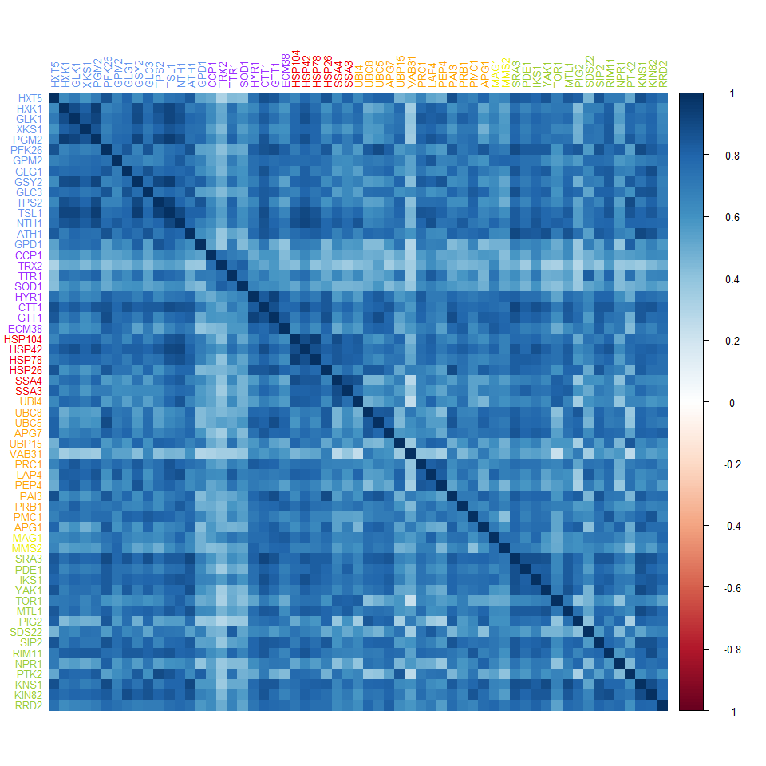
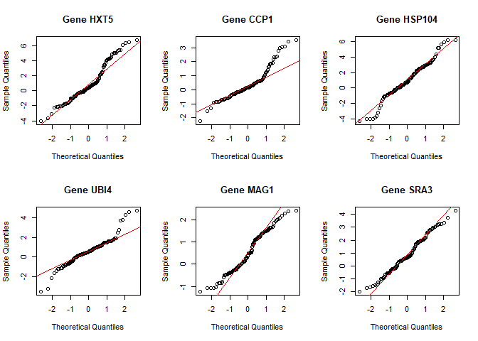
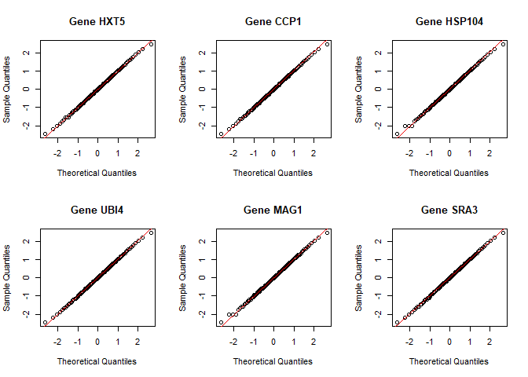
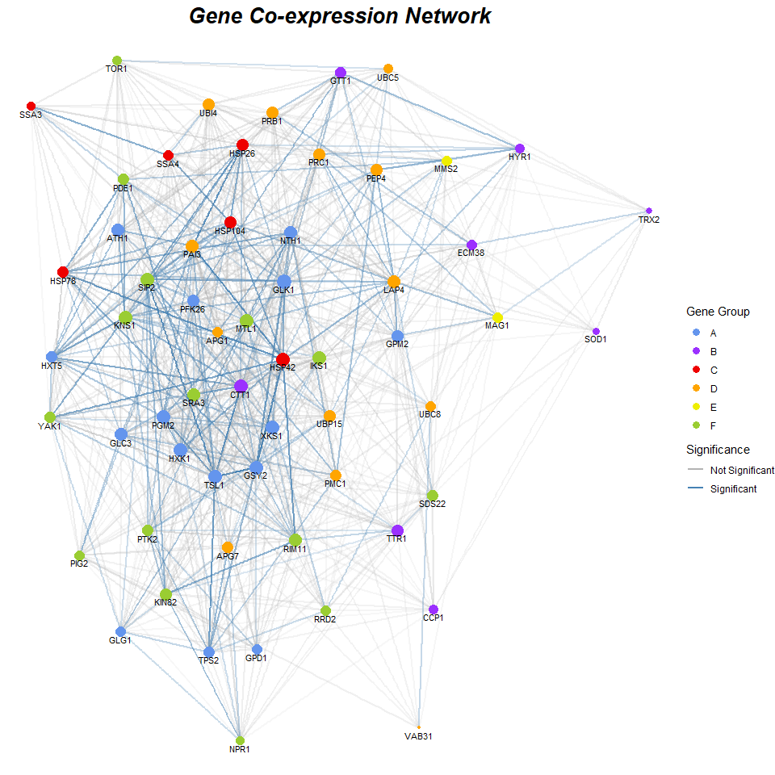
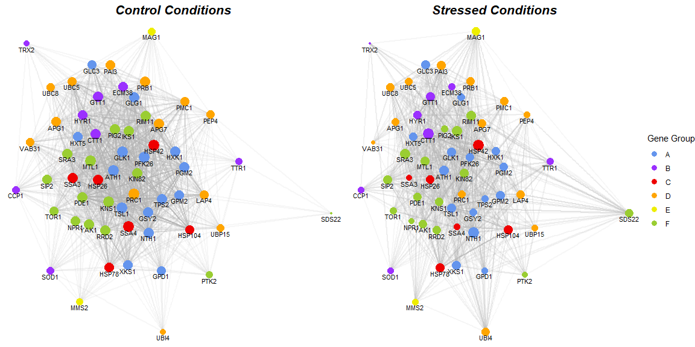
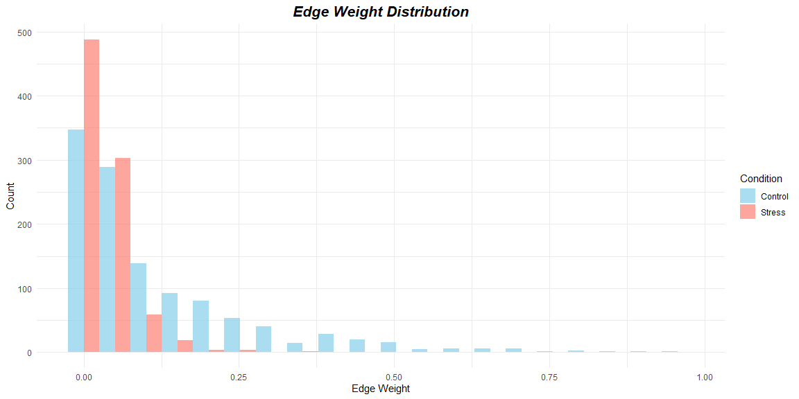

Network analysis of gene expression data: a case study in *Saccharomyces
cerevisiae*
================

## Introduction

In this analysis, we explore the gene expression data from the
`gaschYHS` dataset (Gasch et al. 2000), which contains measurements of
gene expression levels in *Saccharomyces cerevisiae* (baker’s yeast)
under various environmental stress conditions. Our goal is to construct
and analyze gene co-expression networks to identify key genes and their
interactions under both control and stressed conditions.

``` r
# Load necessary libraries
library(gaschYHS)
library(dplyr)
library(corrplot)
library(ggplot2)
library(graphSI)
library(igraph)
library(ggraph)
library(scales)
library(networktools)
library(gridExtra)

# Load the gene expression dataset  
data(gaschYHS)
```

The `gaschYHS` dataset contains gene expression levels for various genes
under different environmental stress conditions. Note that, since each
observation is collected under a different condition, the data points
are not independent and identically distributed (i.i.d.). Our goal is to
pool these conditions and estimate an “average network” of gene
co-expression across all these conditions. In the last section, we will
also compare networks estimated separately on control and stressed
conditions.

We will focus on a subset of genes known to be involved in specific
biological processes. In particular, we will analyze genes involved in
the following functions:

- Carbohydrate metabolism (group A)
- Cellular redox reactions and defense against reactive oxygen species
  (group B)
- Protein folding (group C)
- Protein degradation and vacuolar functions (group D)
- DNA damage repair (group E)
- Intracellular signaling (group F)

These groups are identified in the original publication by Gasch et
al. (2000).

Some of the genes in these groups may not be present in the dataset; we
will handle this by checking for their presence and excluding any
missing genes from our analysis. Furthermore, we will remove genes with
more than 10 missing values and conditions with any remaining missing
values to ensure a complete dataset for our analysis.

``` r
# group A: genes involved in carbohydrate metabolism
genesA <- c("HXT5","HXK1","GLK1","YDR516C","XKS1","PGM2","PFK26",
            "FBP26","GPM2","GLG1", "GSY2","GLC3","TPS2","TPS1",
            "TSL1","NTH1","ATH1", "GPD1")

# group B: genes involved in cellular redox reactions and defense against reactive oxygen species
genesB <- c("CCP1","TRX2","TTR1","SOD1","HYR1","GPX1",
            "CTT1","YDR453C","YBL064C", "YCL035C", "GTT1", "ECM38")

# group C: genes involved in protein folding
genesC <- c("HSP104","HSP42","HSP78", "HSP26","SSA4","SSA3","SSE2")

# group D: genes involved in protein degradation and vacuolar functions
genesD <- c("UBI4","UBC8","UBC5","APG7","UBP15","VAB31","PRC1","YBR139W","LAP4","PEP4",
            "PAI3","PRB1","PMC1","AUT7","APG1")

# group E: genes involved in DNA damage repair
genesE <- c("MAG1","MMS2")

# group F: genes involved in intracellular signaling
genesF <- c("SRA3","PKA3","PDE1", "IKS1", "YAK1", "TOR1", "MTL1", "PIG2", 
            "SDS22", "SIP2", "RIM11", "NPR1", "PTK2", "KNS1", "KIN82", 
            "YIL113W", "RRD2")

genes <- c(genesA, genesB, genesC, genesD, genesE, genesF)
 
expr_list <- lapply(genes, function(g) {
  if(length(gaschYHS@assayData[["exprs"]][which(gaschYHS@featureData@data[["GENE"]] == g), ]) == 0) {
    print(paste("Gene", g, "not found in dataset"))
    return(rep(NA, ncol(gaschYHS@assayData[["exprs"]])))
  } else{
    return(gaschYHS@assayData[["exprs"]][which(gaschYHS@featureData@data[["GENE"]] == g), ])
  }
})
```

    ## [1] "Gene YDR516C not found in dataset"
    ## [1] "Gene GPX1 not found in dataset"
    ## [1] "Gene YDR453C not found in dataset"
    ## [1] "Gene YBL064C not found in dataset"
    ## [1] "Gene YCL035C not found in dataset"
    ## [1] "Gene YBR139W not found in dataset"
    ## [1] "Gene YIL113W not found in dataset"

``` r
# Match genes to their group, assign a color
gene_group <- data.frame(
  gene = genes,
  group = c(
    rep("A", length(genesA)),
    rep("B", length(genesB)),
    rep("C", length(genesC)),
    rep("D", length(genesD)),
    rep("E", length(genesE)),
    rep("F", length(genesF))
  ),
  color = c(
    rep("cornflowerblue", length(genesA)),
    rep("purple1", length(genesB)),
    rep("red2", length(genesC)),
    rep("orange", length(genesD)),
    rep("yellow2", length(genesE)),
    rep("olivedrab3", length(genesF))
  ),
  stringsAsFactors = FALSE
)

# We transpose the data to have genes in columns: we are interested in gene co-expression
df <- as.data.frame(t(data.frame(do.call(rbind, expr_list))))

colnames(df) <- genes
df <- df %>% select(where( ~!all(is.na(.))))

# Remove genes and conditions with many missing values
df <- df %>% select(which(colSums(is.na(.)) < 10))
df <- df %>% filter(rowSums(is.na(.)) == 0)

# Remove the removed genes also from gene_groups
gene_group <- gene_group %>% filter(gene %in% colnames(df))
```

In the final dataset, we have 117 observations (conditions) and 59 genes
with complete data for analysis.

## Exploratory Data Analysis

We begin by examining the correlation structure of the selected genes. A
correlation matrix provides insights into the pairwise relationships
between gene expression levels.

``` r
# Compute the correlation matrix
cor_matrix <- cor(df)

# Visualize the correlation matrix
corrplot(cor_matrix, method = "color", tl.srt = 90,
         tl.col = gene_group$color, tl.cex = 0.8)
```

<!-- -->

From the correlation matrix, we can observe the following patterns:

- no genes are negatively correlated with each other;
- strong positive correlations exist among genes;
- genes in group A are highly correlated with each other;
- some genes in group B are less correlated with all genes, only with
  each other;
- genes in group C are highly correlated with each other and with group
  A;
- some genes in group F are highly correlated with group A and C and
  with each other;
- in particular, genes TRX2 and VAB31 have low correlation with other
  genes.

In order to apply Gaussian graphical models, we need to check the
normality assumption of the data. We will use QQ plots to assess the
normality of the gene expression levels for a representative gene from
each group. Since the data deviates from normality, we apply a
non-paranormal transformation to the marginals to better satisfy the
normality assumption. Note that to completely satisfy the assumptions of
Gaussian graphical models, we need to further assume that the
multivariate dependence structure is a Gaussian copula.

``` r
# Check normality for the first gene of each group
par(mfrow=c(2,3))
for(g in c(genesA[1], genesB[1], genesC[1], genesD[1], genesE[1], genesF[1])) {
  qqnorm(df[[g]], main = paste("Gene", g))
  qqline(df[[g]], col = "red2")
}
mtext("Normal QQ-plots on original marginals", outer = TRUE, side=3, line=1, cex=2, font=2)
```

<!-- -->

``` r
# Non-paranormal transformation on the marginals
df <- huge::huge.npn(as.matrix(df), npn.func = "shrinkage")
```

    ## Conducting the nonparanormal (npn) transformation via shrunkun ECDF....done.

``` r
df <- as.data.frame(df)

# Check normality again after transformation
# title for the plots
par(mfrow=c(2,3))
for(g in c(genesA[1], genesB[1], genesC[1], genesD[1], genesE[1], genesF[1])) {
  qqnorm(df[[g]], main = paste("Gene", g))
  qqline(df[[g]], col = "red2")
}
mtext("Normal QQ-plots on transformed marginals", outer = TRUE, side=3, line=1, cex=2, font=2)
```

<!-- -->

## Gene Co-expression Network Selection, Estimation and Inference

We now construct the gene co-expression network using the `graphSI`
package. For simplicity, we use data splitting. First, select a sparse
graph using 50% of the data, and an elastic net penalty (Kovács et
al. 2021) to deal with potential multicollinearity among gene expression
levels. On the remaining 50% of the observations, estimate the edge
weights of the selected graph and perform statistical inference to
identify significant edges in the network. This ensures we are not
reusing the same data for selection and inference and thus biasing the
results. The non-significance of some edges means that there is not
enough evidence in the data to reject the hypothesis of the edge being
zero.

``` r
# Select a graph on the entire dataset using the graphical elastic net
n <- nrow(df)
p <- ncol(df)
selected_graph <- graphSelect(df, penalty="elastic net", data.splitting = T, penalize.diagonal = F)
adjacency_matrix <- selected_graph$adjacency.matrix

# Estimate the graph in the selected model and do inference on all selected edges
estimated_graph <- graphInference(df, selected_graph, to.test="all", nullvalue=0)
W <- estimated_graph$estimated.graph

# Visualize the estimated graph with ggraph
nodes <- data.frame(id = 1:p, name = gene_group$gene, Group = gene_group$group, color = gene_group$color)
edges <- cbind(which(W != 0, arr.ind = TRUE), Weight = rescale(abs(W)[W != 0]))
edges <- as.data.frame(edges) %>% filter(row > col) %>% rename(from = row, to = col)
gene_graph <- graph_from_data_frame(d = edges, vertices = nodes, directed = FALSE)

# Which edges are significant?
sign_pvals <- which(estimated_graph$inference$p_value > 0.05)
i <- estimated_graph$inference$row[sign_pvals]
j <- estimated_graph$inference$col[sign_pvals]

# different color for significant and non significant edges
edges$Significance <- ifelse(paste(edges$from, edges$to) %in% paste(i, j), "Not Significant", "Significant")
gene_graph <- graph_from_data_frame(d = edges, vertices = nodes, directed = FALSE)
ggraph(gene_graph, layout = "fr") +
  geom_edge_link(aes(alpha = Weight, color = Significance), width = 1) +
  scale_edge_color_manual(values = c("Significant" = "steelblue", "Not Significant" = "grey70")) +
  geom_node_point(aes(color = Group, size = rescale(degree(gene_graph)))) +
  scale_color_manual(values = setNames(gene_group$color, gene_group$group)) +
  geom_node_text(aes(label = name), vjust = 1.5, size = 3) +
  guides(edge_alpha = "none", size = "none", color = guide_legend(title = "Gene Group", override.aes = list(size = 3))) +
  theme_void() +
  ggtitle("Gene Co-expression Network") +
  theme(plot.title = element_text(hjust = 0.5, size = 20, face = "bold.italic"))
```

<!-- -->

## Network Analysis: Hub and Bridging Genes

We will now analyze the network to identify hub genes, which are highly
connected nodes in the network, and bridging genes, which connect to
different gene groups. Hub genes may play crucial roles in maintaining
the structure and function of the gene co-expression network, while
bridging genes may facilitate communication between different biological
processes.

Genes with high node strength are considered hub genes, while genes with
high bridge centrality connect different gene groups. Many genes in
group A (carbohydrate metabolism) are identified as hub genes,
indicating their central role in the network. On the other hand, genes
in group B (cellular redox reactions) tend to have lower connectivity,
suggesting they may function more independently within the network.
Confirming the exploratory analyses, genes *VAB31*, *TRX2*, *SOD1* have
low values on both metrics, indicating they are less connected and more
isolated in the network.

``` r
# Top 10 hub genes by node strength

strength_values <- igraph::strength(gene_graph)
top_hub_genes <- names(sort(strength_values, decreasing = TRUE))[1:10]
hub_table <- data.frame(
  Strength = strength_values[top_hub_genes],
  Group = V(gene_graph)$Group[match(top_hub_genes, V(gene_graph)$name)]
)
colnames(hub_table) <- c("Node Strength", "Group")

# The least connected genes are
least_connected_genes <- names(sort(strength_values, decreasing = FALSE))[1:10]
least_table <- data.frame(
  Strength = strength_values[least_connected_genes],
  Group = V(gene_graph)$Group[match(least_connected_genes, V(gene_graph)$name)]
)
colnames(least_table) <- c("Node Strength", "Group")

# Bridge centrality
bridge_values <- bridge(gene_graph, communities = V(gene_graph)$Group)
bridging_hubs <- names(sort(bridge_values$`Bridge Strength`, decreasing = TRUE))[1:10]
bridge_table <- data.frame(
  Bridge_Strength = bridge_values$`Bridge Strength`[bridging_hubs],
  Group = V(gene_graph)$Group[match(bridging_hubs, V(gene_graph)$name)]
)
colnames(bridge_table) <- c("Bridge Strength", "Group")

most_localized <- names(sort(bridge_values$`Bridge Strength`, decreasing = FALSE))[1:10]
localized_table <- data.frame(
  Bridge_Strength = bridge_values$`Bridge Strength`[most_localized],
  Group = V(gene_graph)$Group[match(most_localized, V(gene_graph)$name)]
)
colnames(localized_table) <- c("Bridge Strength", "Group")
```

<div style="display: inline-block; vertical-align: top; margin-right: 20px;">

<h4>

Top 10 Hub Genes
</h4>

|       | Node Strength | Group |
|:------|--------------:|:------|
| GLK1  |            43 | A     |
| PGM2  |            40 | A     |
| TSL1  |            39 | A     |
| HSP42 |            39 | C     |
| IKS1  |            39 | F     |
| GSY2  |            38 | A     |
| CTT1  |            38 | B     |
| KNS1  |            38 | F     |
| HXK1  |            37 | A     |
| XKS1  |            37 | A     |

</div>

<div style="display: inline-block; vertical-align: top; margin-right: 20px;">

<h4>

Least Connected Genes
</h4>

|       | Node Strength | Group |
|:------|--------------:|:------|
| VAB31 |             8 | D     |
| TRX2  |            11 | B     |
| SOD1  |            13 | B     |
| SSA3  |            17 | C     |
| NPR1  |            18 | F     |
| CCP1  |            19 | B     |
| HYR1  |            19 | B     |
| UBC5  |            19 | D     |
| TOR1  |            21 | F     |
| GLG1  |            22 | A     |

</div>

<div style="display: inline-block; vertical-align: top; margin-right: 20px;">

<h4>

Top 10 Bridging Hubs
</h4>

|       | Bridge Strength | Group |
|:------|----------------:|:------|
| CTT1  |              36 | B     |
| HSP42 |              34 | C     |
| GLK1  |              32 | A     |
| IKS1  |              31 | F     |
| PGM2  |              27 | A     |
| TSL1  |              27 | A     |
| KNS1  |              27 | F     |
| GSY2  |              26 | A     |
| LAP4  |              26 | D     |
| SRA3  |              26 | F     |

</div>

<div style="display: inline-block; vertical-align: top;">

<h4>

Most Localized Nodes
</h4>

|       | Bridge Strength | Group |
|:------|----------------:|:------|
| TRX2  |               5 | B     |
| VAB31 |               5 | D     |
| SOD1  |               8 | B     |
| GLG1  |              12 | A     |
| SSA3  |              12 | C     |
| NPR1  |              12 | F     |
| UBC5  |              13 | D     |
| GPD1  |              14 | A     |
| HYR1  |              14 | B     |
| APG1  |              14 | D     |

</div>

## Comparison of Gene Co-expression Networks under Control and Stressed Conditions

Finally, we will compare the gene co-expression networks constructed
from control conditions and stressed conditions. This comparison will
help us understand how environmental stress affects gene interactions
and identify any changes in network structure or key genes.

We exclude mutants (*msn1*, *msn4*, *yap1*) and wild-type strains
(*DBY7286* strain) from the analysis, as they represent genetic
perturbations rather than environmental stress.

As the non-stressed (control) conditions, we consider:

- experiments at 0 minutes;
- stationary phase in YPD medium;
- steady state experiments;
- growth in stationary different temperatures.

As the stressed conditions, we consider all other experiments.

``` r
control <- grep(
  "Heat.Shock.000.minutes|YPD.stationary.phase|steady.state|deg\\.growth|dtt.000.min..dtt.2",
  rownames(df)
)

# exclude mutants and wild-type strains
mutants <- grep("msn", "Msn", "yap", "Yap", "7286", rownames(df))
control <- setdiff(control, mutants)
stress <- setdiff(1:nrow(df), control)
stress <- setdiff(stress, mutants)

df_control <- df[control, ]
df_stress <- df[stress, ]
```

We obtain 24 observations for the control group and 93 observations for
the stressed group.

We compare the two networks by visualizing them side by side, analyzing
the top hub genes in each network, and examining the distribution of
edge weights. Due to the small sample size in the control group, we do
not perform statistical inference here, but only visualize the estimated
graphs. The penalty parameter for graph selection is adjusted according
to the sample size in each group. Due to the low sample size, and the
different sample sizes between the two groups, we should be cautious in
interpreting the results. The stress graph is denser than the control
one, indicating that stress conditions may induce more complex gene
interactions.

We further examine the distribution of edge weights in both networks to
see how stress conditions may affect the strength of gene interactions.
The edge weights in the stressed condition tend to be higher, indicating
not only more connections between genes under stress, as seen in the
selected graphs, but also stronger ones.

``` r
# Compare the co-regulation graphs

selected_graph_c <- graphSelect(df_control, penalty="elastic net", lambda=3*sqrt(log(p)/nrow(df_control)), data.splitting = F, penalize.diagonal = T)
adjacency_matrix_c <- selected_graph_c$adjacency.matrix
estimated_graph_c <- graphInference(df_control, selected_graph_c, to.test="none", nullvalue=0)
W_c <- estimated_graph_c$estimated.graph
selected_graph_s <- graphSelect(df_stress, penalty="elastic net", lambda=3*sqrt(log(p)/nrow(df_stress)), data.splitting = F, penalize.diagonal = T)
adjacency_matrix_s <- selected_graph_s$adjacency.matrix
estimated_graph_s <- graphInference(df_stress, selected_graph_s, to.test="none", nullvalue=0)
W_s <- estimated_graph_s$estimated.graph

nodes <- data.frame(id = 1:p, name = gene_group$gene, Group = gene_group$group, color = gene_group$color)

edges_c <- cbind(which(W_c != 0, arr.ind = TRUE), Weight = rescale(abs(W_c)[W_c != 0]))
edges_c <- as.data.frame(edges_c) %>% filter(row > col) %>% rename(from = row, to = col)
edges_s <- cbind(which(W_s != 0, arr.ind = TRUE), Weight = rescale(abs(W_s)[W_s != 0]))
edges_s <- as.data.frame(edges_s) %>% filter(row > col) %>% rename(from = row, to = col)

gene_graph_c <- graph_from_data_frame(d = edges_c, vertices = nodes, directed = FALSE)
gene_graph_s <- graph_from_data_frame(d = edges_s, vertices = nodes, directed = FALSE)

layout_c <- create_layout(gene_graph_c, layout = "fr")
coords <- layout_c[, c("x","y")]
coords <- as.matrix(coords)

p1 <- ggraph(layout_c) +
  geom_edge_link(aes(alpha = Weight), color = "grey70", width = 1) +
  geom_node_point(aes(color = Group,
                      size = rescale(degree(gene_graph_c)))) +
  scale_color_manual(values = setNames(gene_group$color, gene_group$group)) +
  geom_node_text(aes(label = name), vjust = 1.5, size = 3) +
  theme_void()+
  theme(legend.position = "none")
p2 <- ggraph(gene_graph_s, layout = coords) +
  geom_edge_link(aes(alpha = Weight), color = "grey70", width = 1) +
  geom_node_point(aes(color = Group,
                      size = rescale(degree(gene_graph_s)))) +
  scale_color_manual(values = setNames(gene_group$color, gene_group$group)) +
  geom_node_text(aes(label = name), vjust = 1.5, size = 3) +
  theme_void() +
  guides(edge_alpha = "none", size = "none", color = guide_legend(title = "Gene Group", override.aes = list(size = 3)))

grid.arrange(p1 + ggtitle("Control Conditions") +
               theme(plot.title = element_text(hjust = 0.5, size = 16, face = "bold.italic")),
             p2 + ggtitle("Stressed Conditions") +
               theme(plot.title = element_text(hjust = 0.5, size = 16, face = "bold.italic")),
             ncol=2)
```

<!-- -->

``` r
# Histogram of edge weights in control and stress
edges_c$Condition <- "Control"
edges_s$Condition <- "Stress"
edges_all <- rbind(edges_c, edges_s)
ggplot(edges_all, aes(x = Weight, fill = Condition)) +
  geom_histogram(position = "dodge", bins = 20, alpha = 0.7) +
  scale_fill_manual(values = c("Control" = "skyblue", "Stress" = "salmon")) +
  labs(title = "Edge Weight Distribution",
       x = "Edge Weight",
       y = "Count") +
  theme_minimal() +
  theme(plot.title = element_text(hjust = 0.5, size = 16, face = "bold.italic"))
```

<!-- -->

Finally, we analyze the top hub genes and least connected genes in each
network. In the control conditions, hubs are mostly from group A,
suggesting these genes dominate central positions under normal
conditions. Under environmental stress, group F becomes prominent,
possibly reflecting the activation of stress-response pathways.

``` r
# Top hub genes in control
strength_values_c <- igraph::strength(gene_graph_c)
top_hub_genes_c <- names(sort(strength_values_c, decreasing = TRUE))[1:10]
hub_table_c <- data.frame(
  Strength = strength_values_c[top_hub_genes_c],
  Group = V(gene_graph_c)$Group[match(top_hub_genes_c, V(gene_graph_c)$name)]
)
colnames(hub_table_c) <- c("Node Strength", "Group")

# Top hub genes in stress
strength_values_s <- igraph::strength(gene_graph_s)
top_hub_genes_s <- names(sort(strength_values_s, decreasing = TRUE))[1:10]
hub_table_s <- data.frame(
  Strength = strength_values_s[top_hub_genes_s],
  Group = V(gene_graph_s)$Group[match(top_hub_genes_s, V(gene_graph_s)$name)]
)
colnames(hub_table_s) <- c("Node Strength", "Group")

# Less connected genes in control
least_connected_genes_c <- names(sort(strength_values_c, decreasing = FALSE))[1:10]
least_table_c <- data.frame(
  Strength = strength_values_c[least_connected_genes_c],
  Group = V(gene_graph_c)$Group[match(least_connected_genes_c, V(gene_graph_c)$name)]
)
colnames(least_table_c) <- c("Node Strength", "Group")

# Less connected genes in stress
least_connected_genes_s <- names(sort(strength_values_s, decreasing = FALSE))[1:10]
least_table_s <- data.frame(
  Strength = strength_values_s[least_connected_genes_s],
  Group = V(gene_graph_s)$Group[match(least_connected_genes_s, V(gene_graph_s)$name)]
)
colnames(least_table_s) <- c("Node Strength", "Group")
```

<div style="display: inline-block; vertical-align: top; margin-right: 20px;">

<h4>

Top 10 Hub Genes in Control
</h4>

|       | Node Strength | Group |
|:------|--------------:|:------|
| PFK26 |            52 | A     |
| TSL1  |            52 | A     |
| ATH1  |            51 | A     |
| PRC1  |            51 | D     |
| KNS1  |            51 | F     |
| GLK1  |            50 | A     |
| HSP42 |            50 | C     |
| SSA4  |            49 | C     |
| MTL1  |            49 | F     |
| GSY2  |            48 | A     |

</div>

<div style="display: inline-block; vertical-align: top;">

<h4>

Top 10 Hub Genes in Stress
</h4>

|       | Node Strength | Group |
|:------|--------------:|:------|
| CTT1  |            47 | B     |
| HSP42 |            47 | C     |
| NTH1  |            46 | A     |
| IKS1  |            42 | F     |
| SRA3  |            41 | F     |
| RIM11 |            40 | F     |
| ATH1  |            37 | A     |
| GLK1  |            36 | A     |
| SIP2  |            36 | F     |
| KIN82 |            36 | F     |

</div>

<div style="display: inline-block; vertical-align: top; margin-right: 20px;">

<h4>

Least Connected Genes in Control
</h4>

|       | Node Strength | Group |
|:------|--------------:|:------|
| SDS22 |             6 | F     |
| TRX2  |            14 | B     |
| UBI4  |            14 | D     |
| MMS2  |            20 | E     |
| TTR1  |            21 | B     |
| PTK2  |            21 | F     |
| SOD1  |            24 | B     |
| MAG1  |            24 | E     |
| CCP1  |            26 | B     |
| UBP15 |            27 | D     |

</div>

<div style="display: inline-block; vertical-align: top;">

<h4>

Least Connected Genes in Stress
</h4>

|       | Node Strength | Group |
|:------|--------------:|:------|
| TRX2  |            13 | B     |
| VAB31 |            15 | D     |
| PTK2  |            19 | F     |
| SSA3  |            20 | C     |
| NPR1  |            20 | F     |
| SOD1  |            21 | B     |
| MMS2  |            21 | E     |
| GPD1  |            22 | A     |
| CCP1  |            22 | B     |
| SSA4  |            22 | C     |

</div>
